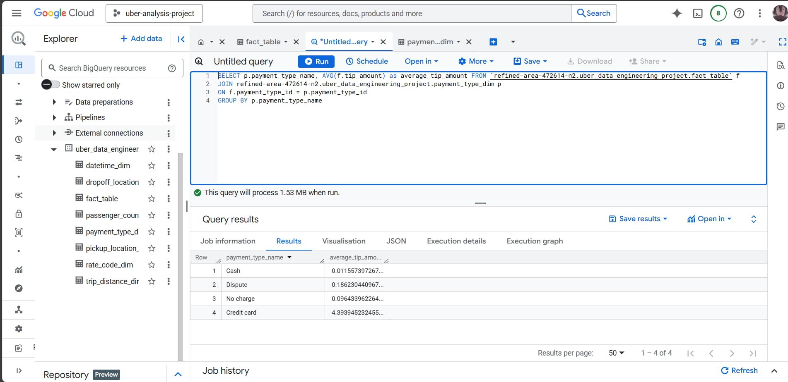

# Uber-Data-Analysis

## Overview

This project focuses on building an end-to-end data pipeline to analyze Uber trip data from the TLC Trip Record Data dataset. We use Python for data processing and Mage.AI for workflow orchestration.

The data is stored in Google Cloud Storage (GCS) and then loaded into Google BigQuery for in-depth analysis. We will design a star schema data model, with a fact table for trip events and various dimension tables for details such as datetime, location. Finally, Google Looker Studio is used to create an interactive dashboard, providing valuable insights for business decision-making.

## Table of Contents
- [Overview](#overview)
- [Architecture](#architecture)
- [Dataset Used](#dataset-used)
- [Data Modeling](#data-modeling)
- [Step in This Project](#step-in-this-project)
- [Results](#results)

## Architecture

### Tech Stacks
Programming Language - Python

Google Cloud Platform
1. Google Cloud Storage
2. Google BigQuery
3. Google Looker Studio

Data Pipeline Tool - https://www.mage.ai/

## Dataset Used
TLC Trip Record Data

Yellow and green taxi trip records include fields capturing pickup and drop-off dates/times, pickup and drop-off locations, trip distances, itemized fares, rate types, payment types, and driver-reported passenger counts. 

More info about dataset :
1. Website - https://www.nyc.gov/site/tlc/about/tlc-trip-record-data.page
2. Data Dictionary - https://www.nyc.gov/assets/tlc/downloads/pdf/data_dictionary_trip_records_yellow.pdf
3. Taxi Zone Map - https://d37ci6vzurychx.cloudfront.net/misc/taxi_zone_lookup.csv

## Data Modeling

## Step in This Project
1. Design Deta Modeling
2. Create fact table and various dimension table 
3. Create and Upload data into GCS Bucket
4. Create Google Bigquery dataset
5. Create ETL Pipeline using Mage.AI data tool load into Google BigQuery
6. In-depth analysis data using Google BigQuey
    1. Find the total fare amount by vendorid
    2. Find the average tip amount by payment type
    3. Find the top 10 pickuplocations based on the number of trips
    4. Find the total number of trips by passenger count
    5. Find the average fare amount by hour of the day
7. Join all dimensions table with fact talbe to create analysis table 
8. Add datasource to Google Looker Studio
9. Create Dashboard

## Results
1. Design Data Modeling

2. Create fact & dimensions table

3. Create GCS Bucket

5. Building ETL Pipeline

6. Load data into Google BigQuery

7. Analysis
    1. Find the total fare amount by vendorid
    
    2. Find the average tip amount by payment type
    
    3. Find the top 10 pickuplocations based on the number of trips
    
    4. Find the total number of trips by passenger count
    
    5. Find the average fare amount by hour of the day 
    
8. Create analysis table

9. Create Dashboard
